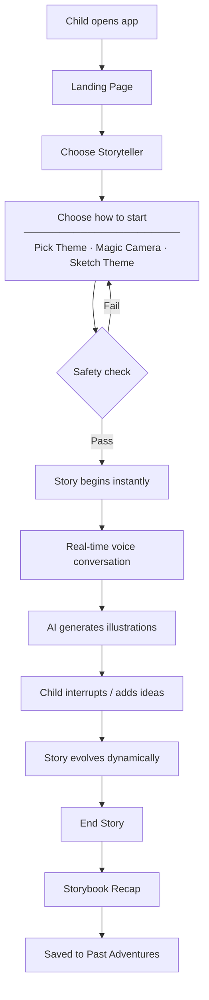

# How It Works



```
Child opens app → Landing page (ambient music, floating animations)
    → "Begin Your Adventure" → Choose a storyteller character
    → ThemeSelect
        Option A: Pick a Theme — 12 adventure tiles + 5 life skills + free-text custom
        Option B: Magic Camera — live viewfinder → capture prop → safety check
                  → AI labels prop → character speaks the label aloud
                  → AI recreates prop as storybook illustration → confirm & start
        Option C: Sketch a Theme — draw on canvas (19 colours) → AI labels sketch
                  → character speaks the label aloud
                  → AI recreates drawing as illustration → confirm & start

    → Story starts → WebSocket connects to backend → backend proxies to Gemini Live API
        → character system prompt + voice sent to Gemini
        → Gemini begins narrating immediately
        → mic capture starts (16kHz audio streamed to Gemini in real time)

Story plays
    → Gemini speaks → audio streamed to browser → played through speakers
    → Gemini triggers illustration at key visual moments
        → POST /api/image with Gemini's scene description
        → previous image passed for visual continuity
        → image fades in alongside the story
    → Fallback: if no illustration triggered in ~25 s, one is generated from the last narration

Achievement badges
    → Gemini awards a badge when the child makes a genuine creative contribution
    → Badge appears on screen, auto-dismisses after 3 s

Pause / Resume
    → Pause mutes playback and suspends mic — session stays alive
    → Resume restores both

Child interrupts (barge-in)
    → Gemini detects speech → stops current narration
    → weaves child's words into the next story beat

Session ends (child says stop or presses End Story)
    → story + badges saved to local gallery automatically
    → "📖 See our story!" button appears
    → POST /api/story-recap with all session images
        → Gemini generates title + per-image narration captions in parallel
    → scrollable storybook rendered and saved to gallery

Past Adventures (landing page)
    → story card grid (thumbnail, title, date)
    → tap any story → full storybook with narrations, badges, "The End"
```
