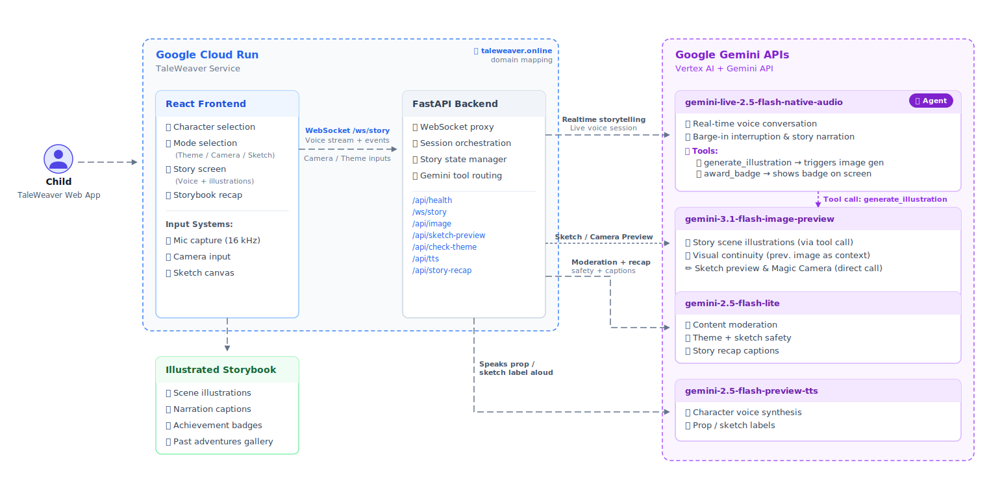

# TaleWeaver

[](https://taleweaver.online)
[](https://cloud.google.com/vertex-ai)
[](https://cloud.google.com/run)
[](https://www.python.org)
[](https://react.dev)

**TaleWeaver turns everyday objects into magical stories.**

A voice-first interactive storytelling app for kids aged **4–10**, powered by **Google Gemini Live** and **Nano Banana 2** 🍌.

Children simply pick a storyteller, hold up a toy or draw an idea, and begin a **real-time conversation** where the AI and child co-create a story together.

Using **Gemini Live**, the storyteller speaks, listens, adapts to interruptions, and generates illustrations as the adventure unfolds.

Kids don't just listen to a story — **they shape it.**

<p align="center">
  <a href="https://www.youtube.com/watch?v=dMHBRXP4IAU">
    
  </a>
  <br/>
  <em>▶ Watch the demo</em>
</p>

## Contents

- [Meet TaleWeaver](#meet-taleweaver)
  - [The Storytellers](#your-storytellers)
  - [The Experience](#the-experience)
    - [Pick a Theme](#1-pick-a-theme)
    - [Magic Camera](#2-magic-camera)
    - [Sketch a Theme](#3-sketch-a-theme)
  - [A Living, Illustrated Story](#a-living-illustrated-story)
  - [Creativity Rewards](#creativity-rewards)
  - [Story Recap](#story-recap)
- [Key Features](#key-features)
- [Architecture](#architecture)
- [Built With](#built-with)
- [Try It Out](#try-it-out)
- [Running Locally](#running-locally)
- [Deploying to Google Cloud](#deploying-to-google-cloud)
- [Roadmap](#roadmap)

---

# Meet TaleWeaver

## The Storytellers

TaleWeaver is powered by **Gemini Live's native audio model** — which means each character has a real voice, speaks fluently in their own language, and holds a genuine back-and-forth conversation with the child. Not text-to-speech. Not a chatbot. A living storyteller.

**5 English storytellers. 5 world-language storytellers.** Each one language-locked — they never switch to English, even if the child does.

> **Note:** World-language characters are experimental — they showcase Gemini Live's multilingual capabilities but still need polish. English storytellers are the primary, fully-tested experience.

| Character | Language | Style |
|---|---|---|
| Wizard Wally | English | Magical adventures |
| Fairy Flora | English | Enchanted fairy tales |
| Captain Coco | English | Pirate adventures |
| Robo Ricky | English | Sci-fi robot stories |
| Rajkumari Meera | English (Indian accent) | Indian folk tales |
| Dadi Maa | Hindi | Traditional bedtime stories |
| Raja Vikram | Tamil | Legendary Tamil tales |
| Yé Ye | Mandarin | Wise storytelling |
| Abuelo Miguel | Spanish | Warm family stories |
| Mamie Claire | French | Cozy storybook adventures |

<br/>

<p align="center">
  
</p>

---

## The Experience

Children start a story in **three magical ways**:

<p align="center">
  
</p>

---

### 1. Pick a Theme

Choose from adventure themes or life-skills topics

Or type **anything their imagination invents**.

<p align="center">
  
</p>

If a custom theme isn't appropriate for children, a friendly message blocks it before the story starts.

<p align="center">
  
</p>

---

### 2. Magic Camera

Hold up **any toy or object**.

The AI will:

1. Recognise the object
2. Transform it into a **storybook character**
3. Turn it into the **hero of the story**

Examples:

```
Stuffed penguin   → A fluffy penguin pal
LEGO rocket    → Galactic rescue pilot
```

If the object shown is inappropriate, the safety filter blocks it before the story starts.

<p align="center">
  
  
</p>

---

### 3. Sketch a Theme

Kids can **draw anything** on a canvas.

The AI turns the drawing into a **storybook illustration** and starts a story around it.

Draw mountains, a house, a robot, a dragon, a castle, a flying whale — and watch it come to life. If the drawing is inappropriate, the safety filter blocks it before the story starts.

<p align="center">
  
  
</p>

---

## A Living, Illustrated Story

Unlike traditional story generators, TaleWeaver is **fully conversational**. Children can interrupt the storyteller, change the story direction, add characters, and invent new twists at any moment.

```
AI:    The ant, the ladybug, and the fairy were tired after their long journey...

Child: Make a cloud their bed!

AI:    And just like that, a soft fluffy cloud floated down,
       curling around them like the cosiest bed in the world!
```

Barge-in is native — Gemini detects when the child starts speaking, stops the current narration, and weaves their words into the next story beat.

As the story unfolds, **illustrations appear automatically**. Gemini decides the right visual moment — a new location, character reveal, or dramatic transformation — and generates an image from its own scene description, so it always matches what was just narrated. Each new image receives the **previous image as context**, keeping characters and art style consistent across every scene.

<p align="center">
  
</p>

---

## Creativity Rewards

TaleWeaver recognises and celebrates when a child contributes something genuinely imaginative.

When a child suggests a wild idea, invents a new character name, or takes the story in an unexpected direction, **Gemini awards them a creativity badge** on the spot.

The badge appears in the centre of the screen and auto-dismisses after a few seconds — a small moment of delight that tells the child their imagination matters.

Badges are saved with the story and shown in the **Story Recap** and **Past Adventures gallery**.

<p align="center">
  
</p>

---

## Story Recap

When the adventure ends, the app generates a **storybook recap**.

All session images are sent to Gemini, which generates a storybook title and a narration for each scene. Original session images are reused — no new images generated during recap.

Children get a scrollable storybook with title, illustrated scenes, narration captions, and creativity badges. All saved to the **Past Adventures gallery**.

<p align="center">
  
</p>

All completed stories are saved locally and accessible from the landing page. Tap any card to re-read the full storybook.

<p align="center">
  
</p>

---

# Key Features

- **Barge-in voice conversation** — Gemini Live listens while it speaks; kids interrupt naturally mid-sentence
- **Autonomous illustrations** — the agent decides the right visual moment and writes its own scene description
- **Visual continuity** — each image is generated with the previous as context; characters stay consistent
- **Magic Camera** — hold up any toy; Gemini names it, draws it, makes it the hero
- **Sketch-to-story** — draw anything on the canvas; it becomes the opening illustration
- **10 storyteller characters** — 5 English + 5 world-language (Hindi, Tamil, Mandarin, Spanish, French), each language-locked
- **Creativity badges** — the agent awards a badge when a child contributes something genuinely imaginative
- **Story recap storybook** — illustrated scenes + narrations generated from the session; saved to Past Adventures
- **Kid-safe content moderation** — themes, camera props, and sketches safety-checked before the story starts
- **Pause / resume** — session and WebSocket stay alive while paused

---

# Architecture

<p align="center">
  
</p>

Four Gemini models, each with a distinct role:

| Model | Role |
|---|---|
| `gemini-live-2.5-flash-native-audio` | **The Agent** — real-time voice, barge-in, autonomous tool calls |
| `gemini-3.1-flash-image-preview` | Scene illustration generation |
| `gemini-2.5-flash-preview-tts` | Character voice for prop/sketch labels |
| `gemini-2.5-flash-lite` | Content moderation + story recap |

### The Agent

`gemini-live-2.5-flash-native-audio` drives the entire experience from within a single real-time audio session. It holds two tools and calls them autonomously mid-narration:

- **`generate_illustration`** — decides the right visual moment, writes its own scene description, triggers image generation. No external timer or trigger.
- **`award_badge`** — recognises genuine creative contributions from the child and silently awards a badge.

### The Backend Proxy

The browser can't connect to Gemini Live directly — Vertex AI requires server-side GCP auth and session orchestration. The FastAPI backend handles authentication, injects character system prompts, routes tool calls, and sends the "Begin!" trigger only after both proxy tasks are running — ensuring no audio is dropped at session start.

### Audio Pipeline

- **Capture:** Mic → 16kHz PCM → WebSocket → Gemini Live
- **Playback:** Gemini → 24kHz PCM → precisely scheduled AudioWorklet → speakers

### Deployment

Single Cloud Run service — Node 22 builds the React frontend, Python 3.13 serves both API and static files. Push to `main` → Cloud Build → Artifact Registry → Cloud Run.

> For a detailed step-by-step flow of how a session works end-to-end, see [HOW_IT_WORKS.md](HOW_IT_WORKS.md).

---

# Built With

### AI Models & APIs
| Model | Role |
|---|---|
| `gemini-live-2.5-flash-native-audio` | **The Agent** — real-time voice conversation, barge-in, and autonomous tool calls (`generate_illustration`, `award_badge`) via Gemini Live API (Vertex AI) |
| `gemini-2.5-flash-lite` | Content moderation (themes, sketches, camera props) + story recap titles and narrations |
| `gemini-2.5-flash-preview-tts` | Character TTS — speaks prop/sketch label in the character's voice on theme select |
| `gemini-3.1-flash-image-preview` | Storybook illustration generation from scene descriptions |

### SDKs & Frameworks
| SDK / Framework | Usage |
|---|---|
| **Google GenAI Python SDK** (`google-genai`) | Image generation, scene extraction, story recap, TTS — all Gemini API calls on the backend |
| **Gemini Live API** (Vertex AI WebSocket) | Bidirectional real-time audio streaming for voice storytelling sessions |
| **FastAPI** | Python backend — WebSocket proxy, REST endpoints, SPA serving |
| **React 19 + Vite + TypeScript** | Frontend SPA |
| **TailwindCSS v3** | Styling |
| **Framer Motion** | Character and UI animations |
| **Web Audio API + AudioWorklet** | 16kHz mic capture and 24kHz PCM playback in the browser |

### Google Cloud Services
| Service | Role |
|---|---|
| **Vertex AI** | Hosts Gemini Live API and Flash Lite model endpoints |
| **Cloud Run** | Single-service deployment — serves both the FastAPI backend and compiled React frontend |
| **Cloud Build** | CI/CD — auto-deploys on every push to `main` via `cloudbuild.yaml` |
| **Artifact Registry** | Stores Docker container images between builds |
| **Secret Manager** | Stores `GEMINI_API_KEY` securely, injected at runtime |
| **Application Default Credentials (ADC)** | Authenticates backend to Vertex AI without embedded keys |

### Languages & Tools
- **Python 3.13** — backend runtime
- **Node 22** — frontend build (multi-stage Docker)
- **Docker** — containerisation
- **WebSockets** — browser ↔ backend and backend ↔ Gemini Live bidirectional streaming

---

# Try It Out

The app is live at **https://taleweaver.online** (also at https://taleweaver-950758825854.us-central1.run.app) — no account, no setup required.

> **Note:** This deployment runs on a GCP free trial account. If the trial has expired by the time you visit, the live app may be unavailable. In that case, please use the [Running Locally](#running-locally) instructions to run it yourself.

1. Open the app on a device with a microphone
2. Click **Begin Your Adventure** → pick a storyteller → choose a theme, use Magic Camera, or draw a Sketch
3. Allow microphone access — the story starts immediately
4. Speak to redirect the story, interrupt mid-sentence, or suggest ideas

---

# Running Locally

**Prerequisites:** Python 3.12+, Node.js 18+, [uv](https://docs.astral.sh/uv/getting-started/installation/), a Google Cloud project with Vertex AI enabled, and a Gemini API key.

> First time? See [QUICKSTART.md](QUICKSTART.md) for step-by-step GCP setup (account, Vertex AI, gcloud auth).

### 1. Clone and install

```bash
git clone https://github.com/padmanabhan-r/TaleWeaver.git
cd TaleWeaver
uv sync && source .venv/bin/activate
```

### 2. Configure environment

```bash
cp backend/.env.example backend/.env
```

Fill in `backend/.env`:

```env
GOOGLE_CLOUD_PROJECT=your-project-id
GOOGLE_CLOUD_LOCATION=us-central1
GOOGLE_GENAI_USE_VERTEXAI=true
GEMINI_API_KEY=your-gemini-api-key        # from Google AI Studio
IMAGE_MODEL=gemini-3.1-flash-image-preview
IMAGE_LOCATION=global
```

### 3. Authenticate with Google Cloud

```bash
gcloud auth application-default login
```

### 4. Run

**One command (recommended):**

```bash
./start.sh
```

Starts backend on port 8000 and frontend on port 8080. Press `Ctrl+C` to stop both.

**Or run separately:**

```bash
# Terminal 1 — backend
cd backend && uvicorn main:app --reload --port 8000

# Terminal 2 — frontend
cd frontend && npm install && cp .env.example .env.local && npm run dev
```

| | URL |
|---|---|
| App | http://localhost:8080 |
| Backend | http://localhost:8000 |
| Health | http://localhost:8000/api/health |

---

# Deploying to Google Cloud

The app deploys as a single Cloud Run service via Cloud Build CI/CD. For full instructions — Secret Manager setup, Cloud Build trigger, and manual deploy — see [DEPLOYMENT_INSTRUCTIONS.md](DEPLOYMENT_INSTRUCTIONS.md).

---

# Roadmap

The immediate focus is polish — fine-tuning prompts, hardening edge cases, and perfecting the end-to-end experience. World-language characters in particular need more testing and refinement before they're ready for everyday use.

Native **iOS and Android apps** are the natural next step to put TaleWeaver where children actually are, with proper mobile audio handling and offline resilience.

| Feature | Notes |
|---|---|
| **Live Camera in Story Mode** | Prototyped but pulled — camera active during narration caused Gemini to break story focus and acknowledge the camera directly. Needs a more seamless integration. |
| **Rive Animated Characters** | Replace Framer Motion portraits with Rive state machine animations — real lip-sync tied to audio amplitude. Blocked on Rive asset creation for all 10 characters. |
| **Learning Mode** | Storyteller weaves curriculum goals (phonics, counting, colours) into the narrative without the child realising they're learning. |
| **Cloud Storage for Past Adventures** | Move from `localStorage` to GCS — images persist across devices and sessions indefinitely, no 20-story cap. |
| **Parent Dashboard** | Session summaries, badge history, themes explored — a window into how your child's imagination works. |

